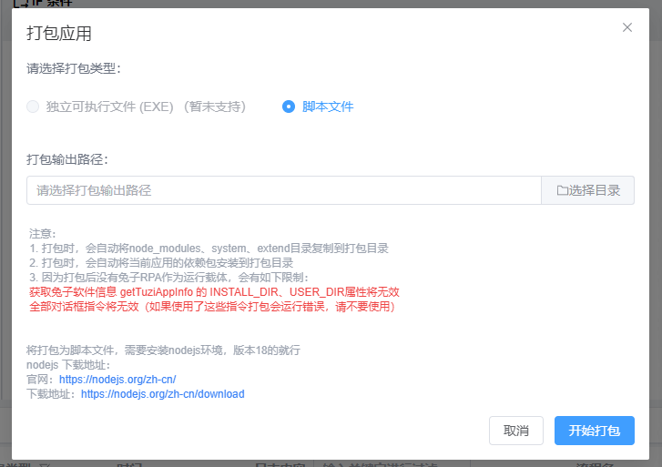

# tuzi_robot
技术使用 vue3 + electron-vite + ts 

## 介绍

tuzi-rpa
自动化流程工具

创造属于自己的自动化流程工具，让人摆脱机器般的工作

## 免责声明

这个项目免费开源，不存在收费。
本工具仅供学习和技术研究使用，不得用于任何商业或非法行为。
本工具的作者不对本工具的安全性、完整性、可靠性、有效性、正确性或适用性做任何明示或暗示的保证，也不对本工具的使用或滥用造成的任何直接或间接的损失、责任、索赔、要求或诉讼承担任何责任。
本工具的作者保留随时修改、更新、删除或终止本工具的权利，无需事先通知或承担任何义务。
本工具的使用者应遵守相关法律法规，尊重微信的版权和隐私，不得侵犯微信或其他第三方的合法权益，不得从事任何违法或不道德的行为。
本工具的使用者在下载、安装、运行或使用本工具时，即表示已阅读并同意本免责声明。如有异议，请立即停止使用本工具，并删除所有相关文件。

指令项目： 移步查看 https://github.com/tuzirpa/tuziRobotDirective
软件文档： https://help.tuzirpa.cn/

## 软件预览

## 流程自动化原理

将可视化界面的数据生成一个一个 js 代码，然后用 nodejs 运行这个项目js,从而实现自动化流程的运行管理
指令 ———— 也就是提供每个js 可运行的函数，这个函数可以运行nodejs 的任何api

感谢 electron-vite 作者的开源： https://github.com/alex8088/electron-vite
